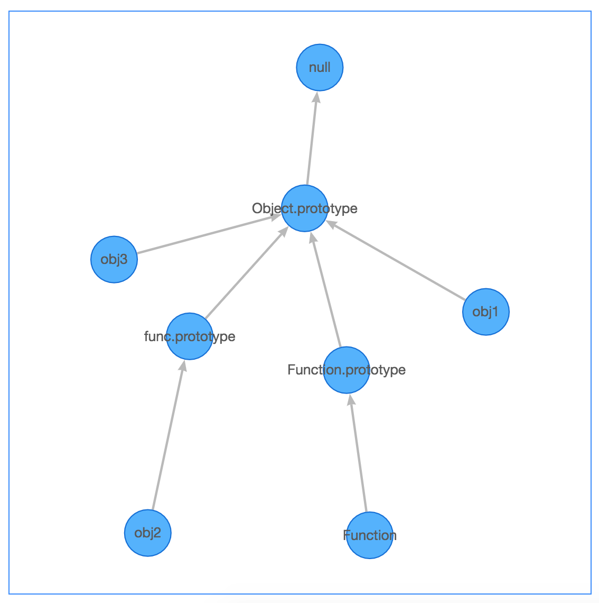

[](https://www.npmjs.com/package/zrototype)
[](https://www.npmjs.com/package/zrototype)

# zrototype
zrototype create graph ↔️ of prototype of given objects.

## Background

恩，写这个的原因是，有些朋友对于原型链和原型继承的理解有误，然后我解释到不想说话了...这个小轮子，跑一下，就让他们自己看去吧...瘫

## Usage

### Demo

⚠️ If code compression is turn on, the name of function is the compressed name.

```javascript
import Zrototype from 'zrototype';

const obj1 = {
  a: 1,
  b: 3
};

function func() {
  this.name = 'func';
}

const obj2 = new func();

const obj3 = {
  head: 3,
  leg: 6
};

const zrototype = new Zrototype({
  objects: [{
    $$name: 'obj1',
    $$value: obj1
  }, {
    $$name: 'obj2',
    $$value: obj2
  }, {
    $$name: 'obj3',
    $$value: obj3
  }]
});

// draw options will be directly passed to G6 graph.
zrototype.draw({
  container: 'app',
  width: 500,
  height: 500
});

// zrototype.objProtoMap => set of obj and its prototype chain.

```

<p align="center">
  
</p>

## Development

```
npm run dev
```